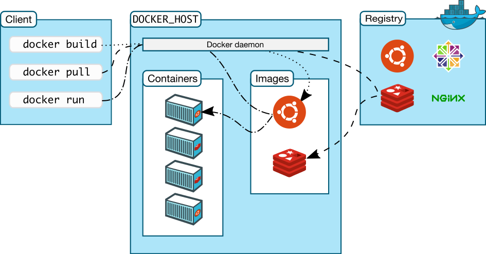

# Docker Architecture
 

Docker
- Images are read only templates used to create containers
- If an image is a class then a container is an instance of a class (a runtime object)
- Containers are lightweight and portable encapsulations of an envirnoment in which we can run our appplications
- In summary Container = Images (binaries + dependencies)
- You can have many containers running off the same image
- Containers are just processes

#### Starting a container - sample commands
`docker container run -d -p 3306:3306 --name db -e MYSQL_RANDOM_ROOT_PASSWORD=yes mysql`

#### Sample Dockerfile
```
# Use an official Python runtime as a parent image
FROM python:2.7-slim

# Set the working directory to /app
WORKDIR /app

# Copy the current directory contents into the container at /app
COPY . /app

# Install any needed packages specified in requirements.txt
RUN pip install --trusted-host pypi.python.org -r requirements.txt

# Make port 80 available to the world outside this container
EXPOSE 80

# Define environment variable
ENV NAME World

# Run app.py when the container launches
CMD ["python", "app.py"]
```


#### Sample Docker compose file
```
version: "3"
services:
  web:
    # Pull the image from Docker registry
    image: darshandeshmukh11/get-started:part2
    deploy:
    # Run 5 instances of that image as a service called web, limiting each one to use, at most, 10% of the CPU (across all cores), and                50MB of RAM
      replicas: 5
      resources:
        limits:
          cpus: "0.1"
          memory: 50M
    # Immediately restart containers if one fails      
      restart_policy:
        condition: on-failure
    # Map port 4000 on the host to web’s port 80.    
    ports:
      - "4000:80"
    # Instruct web’s containers to share port 80 via a load-balanced network called webnet. (Internally, the containers themselves publish to web’s port 80 at an ephemeral port.)  
    networks:
      - webnet
    # Define the webnet network with the default settings (which is a load-balanced overlay network)  
networks:
  webnet:
```

#### Commands for Docker Swarm
```
docker stack ls                                            # List stacks or apps
docker stack deploy -c <composefile> <appname>  # Run the specified Compose file
docker service ls                 # List running services associated with an app
docker service ps <service>                  # List tasks associated with an app
docker inspect <task or container>                   # Inspect task or container
docker container ls -q                                      # List container IDs
docker stack rm <appname>                             # Tear down an application
docker swarm leave --force      # Take down a single node swarm from the manager
```

#### Dockerfile best practices


#### Inspired by
[Play with Docker classroom](https://training.play-with-docker.com/ops-stage1/)
